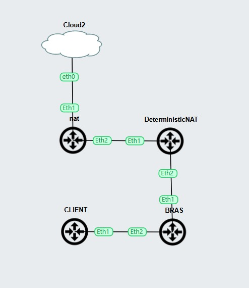
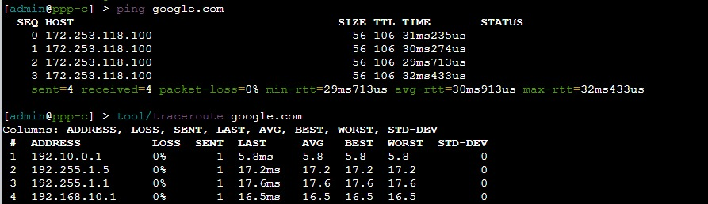

# deterministic-NAT
Deterministic NAT adalah metode penerjemahan alamat jaringan (NAT) yang membagi alamat IP publik dan port secara tetap kepada setiap pelanggan. Berbeda dengan NAT biasa yang memberikan port secara dinamis berdasarkan koneksi yang sedang berjalan, Deterministic NAT sudah menentukan sejak awal pelanggan mana menggunakan IP publik tertentu dan rentang port tertentu.

Dengan metode ini, satu pelanggan akan selalu menggunakan kombinasi IP publik dan blok port yang sama, sehingga proses pelacakan koneksi, pencatatan pengguna, dan penanganan masalah jaringan menjadi lebih mudah. Teknologi ini banyak digunakan pada jaringan ISP dengan jumlah pelanggan besar dan ketersediaan IP publik yang terbatas karena dapat menghemat penggunaan IP sekaligus menjaga kestabilan layanan.

Untuk menghitung kebutuhan port pada Deterministic NAT, rumus dasarnya adalah:

$$\text{Port per pelanggan} = \frac{\text{Jumlah IP Publik} \times \text{Jumlah Port yang dapat digunakan}}{\text{Jumlah Pelanggan}}$$

Note : pada firwall nat RO deterministicNAT menggunkan scrip


```
# Daftar IP Publik
:local pubIPs {"202.1.1.1"; "202.1.1.2"; "202.1.1.3"; "202.1.1.4"; "202.1.1.5"; \
               "202.1.1.6"; "202.1.1.7"; "202.1.1.8"; "202.1.1.9"; "202.1.1.10"; \
               "202.1.1.11"; "202.1.1.12"; "202.1.1.13"; "202.1.1.14"; "202.1.1.15"}

# Pengaturan
:local subnet "192.10.1."
:local startIP 2
:local endIP 254
:local portRange 148
:local currentPort 1024

# Variabel bantu
:local pubIndex 0
:local ipCount [:len $pubIPs]

# Loop Utama
:for i from=$startIP to=$endIP do={
    :local ip ($subnet . $i)
    :local currentPubIP [:pick $pubIPs $pubIndex]
    :local portStart $currentPort
    :local portEnd ($currentPort + $portRange - 1)
    
  # 1. Buat NAT Rule untuk TCP
   /ip firewall nat add \
        chain=srcnat \
        src-address=$ip \
        protocol=tcp \
        action=src-nat \
        to-addresses=$currentPubIP \
        to-ports=($portStart . "-" . $portEnd) \
        comment=("DetNAT-TCP-" . $ip)

  # 2. Buat NAT Rule untuk UDP
   /ip firewall nat add \
        chain=srcnat \
        src-address=$ip \
        protocol=udp \
        action=src-nat \
        to-addresses=$currentPubIP \
        to-ports=($portStart . "-" . $portEnd) \
        comment=("DetNAT-UDP-" . $ip)
 #3.ICMP
   /ip firewall nat add \
    chain=srcnat \
    src-address=$ip \
    protocol=icmp \
    action=src-nat \
    to-addresses=$currentPubIP \
    comment=("DetNAT-ICMP-" . $ip)

   # Increment port dan index IP Publik
    :set currentPort ($currentPort + $portRange)
    :set pubIndex ($pubIndex + 1)
    
  # Reset index jika sudah habis
    :if ($pubIndex = $ipCount) do={ :set pubIndex 0 }
}

```


---
Topology
--


---

Test 
--


---

Device
--
- **Router:** MikroTik RouterOS 7.14.3


